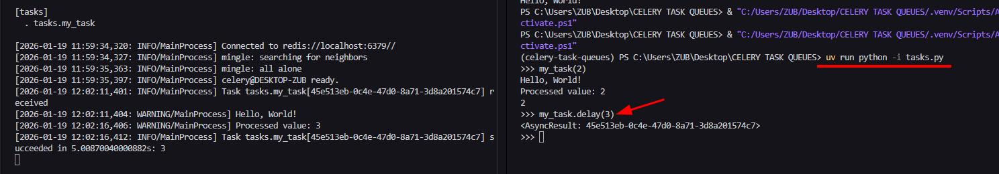
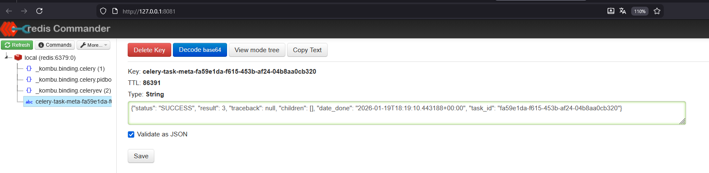

# CELERY TASK QUEUES

## Levantar redis:

```ps
cd docker
docker compose up -d
```

## Probar una tarea

```ps
uv run python -i tasks
>> my_task(3)
exit
```

## Levantando un worker

```ps
uv run celery -A tasks worker --loglevel=info
```

Windows:
El prefork tool luego tiene errores de permisos en windows, ejecutar threads en su lugar

```ps
uv run celery -A tasks worker --pool=threads --loglevel=info
```

El worker responde al generar una tarea asincrona:



